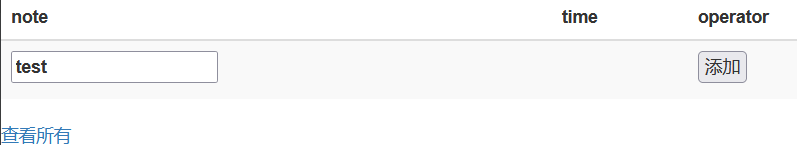
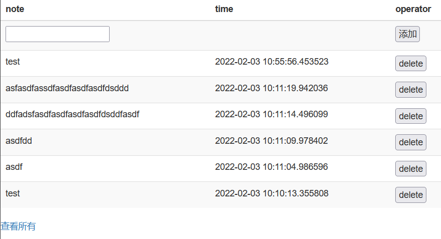

# 简易网络备忘录

## 写在前面

这是一个非常简单的网络备忘录

 - 有密码但是竟然在url里😓
 - 输错密码3次禁止ip，1天解禁
 - 只显示7天备忘录，有删除功能
 - 查看所有就会显示所有历史，包括过期的和删除的
 - 适配移动端

当然这些时间参数都能更改。


## 初始化

### 安装依赖

python3

```shell
pip install -r requirements.txt
```

### 设定参数

参数在`config.py`中，都有注释解释


## 使用

### 运行

```shell
python note_test.py
```

### 网址

网址是`http://` + `地址` + `:` + `端口` + `/` + `密码`

如果默认值没改，就是`http://127.0.0.1:31366/test_password`

### 实例

首页



查看所有

